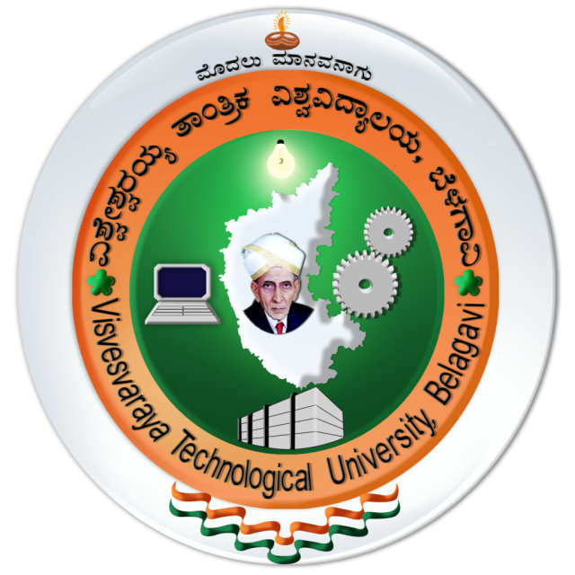

Hey, Thanks for visiting my website. As an MS Computer Science student specializing in AI/ML and Analytics at UCSC, I am deeply passionate about leveraging data to drive meaningful insights and actionable outcomes. With hands-on experience as a Data Scientist, I've developed a strong skill set in building scalable data pipelines and crafting tailored solutions to address diverse business challenges.

In my role, I've had the privilege of collaborating closely with stakeholders to understand their unique data requirements and translate them into actionable strategies. By harnessing the power of data, I've been able to deliver tangible improvements such as increased operational efficiency and reduced manual effort, resulting in measurable business impact.

I thrive on the opportunity to uncover valuable insights hidden within complex datasets and present them in a clear and compelling manner to clients. My goal is to continue pushing the boundaries of what's possible with data analytics, driving innovation and driving business success.

I'm now seeking full-time opportunities where I can apply my expertise in AI/ML, analytics, and data science to make a meaningful contribution. Let's connect and explore how I can help your organization achieve its data-driven objectives.

Experience
======

**Data Scientist, [Gravity iLabs](https://www.gravityilabs.com/)**
#### Feb 2021 - July 2022 | Bangalore, India
------
* Designed and Developed robust and scalable ETL data warehouse with a throughput of 2000 RPS achieved via AWS S3 and Redshift.
* Increased end-users operational efficiency by 70% implementing a centralized dataset which powers over 50 insightful dashboards using Power BI.
* Deployed stored procedures on Azure reducing data processing time by 45% within the data lake.
* Developed a multi-tenancy model, reducing  TAT for client onboarding by 80%. 
* Developed a KNN model to predict project completion status with 92% accuracy based on project objectives, risks, benefits, and budget, empowering business leaders to gauge project complexities and optimize for timely completion.

------

**Data Scientist, [Nokia](https://www.nokia.com/)**
#### Jan 2019 - Feb 2021 | Bangalore, India
------
* Designed and developed a 5G and Small Cells S-Curve dashboard using REST APIs to enable global tracking of development and testing progress across multiple teams. This  resulted in an increase in efficiency in decision-making for business leaders.
* Engineered an advanced JIRA dashboard, utilizing the JIRA API to provide comprehensive project management insights, streamline task management across sprints, resulting in a 30% increase in task efficiency.
* Automated dataset preparation using Python, Postgres, and ETL processes with scheduled cron jobs, resulting in a 90% reduction in manual effort and saving 15+  hours per week.

------

**Software Engineer, [Nokia](https://www.nokia.com/)**
#### Jun 2016 - Dec 2018 | Bangalore, India
------
* Developed an automation suite using RIDE, causing a 40% reduction in testing time and leading to 100% test coverage.
* Conducted High Availability testing, injecting service failures and assessing system behavior to ensure robustness and fault tolerance thereby reducing downtime by 40%.
* Executed 100+ test scenarios, resulting in an improved software quality and a 15% reduction in customer issues.

Education
======

**Master of Science in Computer Science & Engineering, [University of California, Santa Cruz](https://www.ucsc.edu/)**
#### September 2022 - Present | California, USA
------
Currently pursuing my Graduate degree in Computer Science with concentration in AI/ML.  
<strong>CGPA: </strong> 3.9/4.0  
<strong>Relevant coursework:</strong>
* <strong>Winter '24: </strong>Principles of Computer System Design 
* <strong>Fall '23: </strong>Statistical Data Analysis, Deep Learning 
* <strong>Spring '23: </strong>Software Design, Programming Languages 
* <strong>Winter '23: </strong>Artificial Intelligence, Computer Graphics 
* <strong>Fall '22: </strong>Machine Learning, Analysis of Algorithms 
 

------

**Post Graduation Diploma in Data Science, [International Institute of Information Technology, Bangalore](https://www.iiitb.ac.in/)**
#### March 2020 - April 2021 | Bangalore, India
------
<strong>CGPA:</strong> 4.0/4.0   
<strong>Relevant coursework:</strong>  Machine Learning, Advanced Machine Learning, Data Warehousing and Data Mining, Deep Learning  
 

------

**Bachelor of Engineering in Computer Science & Engineering, [Visvesvaraya Technological University, Bangalore](https://vtu.ac.in/)**
#### March 2020 - April 2021 | Bangalore, India
------
<strong>CGPA:</strong> 4.0/4.0   
<strong>Relevant coursework:</strong>  Data Structures, Analysis and Design of Algorithm, Operating Systems, Software Engineering, 
Systems Software  

Key-Skills
======
* <strong> Programming Languages: </strong> Python, R, Java, C, Javascript  
* <strong> Libraries: </strong> PyTorch, Tensorflow, Keras, Numpy, Pandas, Matplotlib, Seaborn, Scikit-learn, Ggplot  
* <strong> Databases: </strong> MySQL, PostgreSQL, Cassandra, MongoDB, SSMS, SSIS  
* <strong> Visualization Tools: </strong> PowerBI, Tableau, Grafana  
* <strong> Modeling: </strong> Linear Regression, Logistic Regression, SVM, Decision Trees, Random Forests, Bagging, Boosting, K-means, KNN, Sentiment Analysis, Lasso Regression, Ridge Regression, Naïve Bayes, Deep Neural Networks, Convolutional Neural Networks, ARIMA, SARIMA  
* <strong> Also skilled in: </strong> AWS EC2, AWS Redshift, S3, GCP, Jira, Git, MS Excel, Computer Vision, CI/CD, Docker, Kubernetes, Data Structures and Algorithms, System Design, REST  

