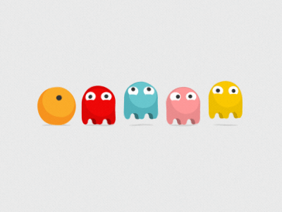
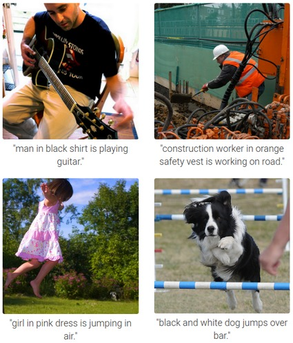

-----

**AI-Powered PacMan Commentary, AIEA Lab, UCSC**
#### Jan 2024 - Present | California, USA

-----
* Engineered a novel approach to analyze Pac-Man gameplay using computer vision to generate spatial representation of game.
* Leveraged advanced LLMs and prompt engineering to generate informative captions for every 5 seconds of gameplay.
* Fine-tuned the model to produce high-quality, contextually relevant commentary, enhancing the overall viewer experience. 

Here is the - [Github Repo](https://github.com/nisthaKumar/AutograderLLMPrompts)

-----

**LLM Smart Chat**
#### Nov 2024 | California , USA

-----
* Leveraged a Large Language Model (LLM) (OpenAI) to answer user queries based on the contents of a pdf file.
* Utilized efficient document chunking and retrieval techniques to ensure that only the most relevant sections of the document are used to generate context-specific answers.

Here is the - [Github Repo](https://github.com/nisthaKumar/LLMSmartChat)

-----

**Road To Chciken Dinner**
#### Nov 2023 - Dec 2023 | California , USA

-----
* Built Multiple Linear Regression model, performed Model selection using AIC & BIC criterion to predict Winning percentile.
* Conducted pair t-tests to assess group significance and utilized p-values to determine the significance of predictors.

Here is the - [Github Repo](https://github.com/nisthaKumar/Road-To-Chicken-Dinner)

-----

**Image Classification Using Transfer Learning**
#### Nov 2023 - Dec 2023 | California, USA

-----
* Trained a Swin Large Vision Transformers on a custom dataset to classify images into 100 classes.
* Utilized Hugging Face’s PyTorch image models library to build and train the transformer and achieved an accuracy of 82%. 

Here is the - [Github Repo](https://github.com/nisthaKumar/Image-Classification-using-Transfer-Learning)

-----

**Eye for the Blind**
#### Jan 2021 - March 2021 | Bangalore, India

-----
* Designed Encoder-Decoder neural network using self-attention and GRU to generate descriptive image captions,
empowering visually impaired individuals to comprehend images; achieved accessibility and inclusiveness for 1000+ users.
* Deployed the model on AWS using FLASK with a TAT of 2 seconds. 

Here is the - [Github Repo](https://github.com/nisthaKumar/Eye-For-The-Blind)

-----

